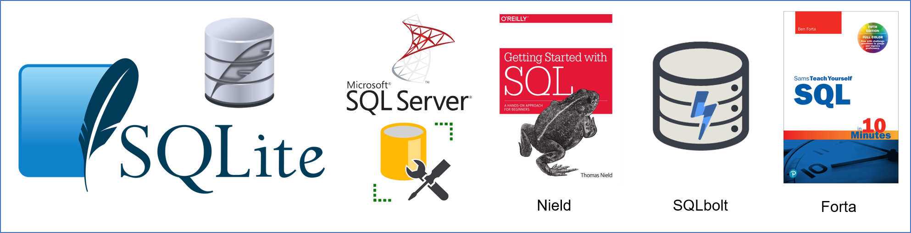

# HIM6217-21S
Repository to accompany Health Care Database Managements (HIM6217) course at the University of Central Florida in the Spring of 2021

# Texts

|   |   |
|---|---|
|![][nield] |Nield, T. (2016). Getting started with SQL: A Hands-On Approach for Beginners. O’Reilly.[(link)][nieldlink]   |
|![][sqlbolt] |  https://sqlbolt.com/  |
|![][forta] |Forta, B. (2019). SQL in 10 Minutes a Day, Sams Teach Yourself. Sams Publishing.[(link)][fortalink]   |

[forta]:libs/images/forta.PNG   
[nield]:libs/images/nield.png      
[sqlbolt]:libs/images/sqlbolt.png
[nieldlink]:https://www.amazon.com/Getting-Started-SQL-Hands-Beginners-ebook-dp-B01BO7HPNC/dp/B01BO7HPNC/ref=mt_other?_encoding=UTF8&me=&qid=
[fortalink]:https://forta.com/books/0135182794/

# Homework 

- [Homework 1][hm1] ([solution][solution1])
- [Homework 2][hm2] ([solution][solution2])
- [Homework 3][hm3] ([solution][solution3])
- [Homework 4][hm4] ([solution][solution4])
- [Homework 5][hm5] ([solution][solution5])
- [Homework 6][hm6] ([solution][solution6])

[hm1]:homework/homework-1-empty.sql
[hm2]:homework/homework-2-empty.sql
[hm3]:homework/homework-3-empty.sql
[hm4]:homework/homework-4-empty.sql
[hm5]:homework/homework-5-empty.sql
[hm6]:homework/homework-6-empty.sql

[solution1]:homework/homework-1.sql
[solution2]:homework/homework-2.sql
[solution3]:homework/homework-3.sql
[solution4]:homework/homework-4.sql
[solution5]:homework/homework-5.sql
[solution6]:homework/homework-6.sql 

# Data

Homework rely on synthetic data bases inspired by the [Medicare Claims Synthetic Public Use Files (SynPUFs)](https://www.cms.gov/Research-Statistics-Data-and-Systems/Downloadable-Public-Use-Files/SynPUFs). For the scripts generating and augmenting these synthetic data bases see [./manipulation/](./manipulation) folder.

- [hmo-1][hmo-1] 
- [synpuf_1][synpuf_1] 
- [synpuf_2][synpuf_2] 
- [synpuf_3][synpuf_3] 

[hmo-1]:data-public/exercises/hmo-1.sqlite3
[synpuf_1]:data-public/exercises/synpuf/synpuf_1.sqlite3
[synpuf_2]:data-public/exercises/synpuf/synpuf_2.sqlite3
[synpuf_3]:data-public/exercises/synpuf/synpuf_3.sqlite3

# Template of Instructions to Outsiders

> I'm glad you’d like to learn sql & databases in general  --it's a big part of what we do as statisticians/analysts.
>
> The easiest way to get self-started is to complete the first 12 lessons of https://sqlbolt.com/.  It's a slick website that teaches & tests you in small manageable chunks.  Lessons 13+ are good too, but not typically used by entry analysts.
> 
> A target audience is a masters student preparing for their first job in health analytics.
> 
> The `homework/` directory might be most useful to you; it's a sequence of 6 assignments.  Each assignment has two sql files: one with only the questions (eg, homework/homework-1-empty.sql) and one with answers (homework/homework-1.sql).  The top of each homework indicates what database to use (ie, synpuf_1), which can be found in data-public/exercises/synpuf/.
>
> The course relied on two (short & cheap) books found in the readme.md file in the root directory (Nield, 2016; Forta, 2019).
>
> Finally, here is an introduction to SQLiteStudio.  It's easily installed on your machine, and fairly similar to the database engines used in most of health research. https://www.youtube.com/watch?v=o_L0gwt4ysA
